# 🎓 CollabCore - Student Collaboration Platform

<p align="center">
  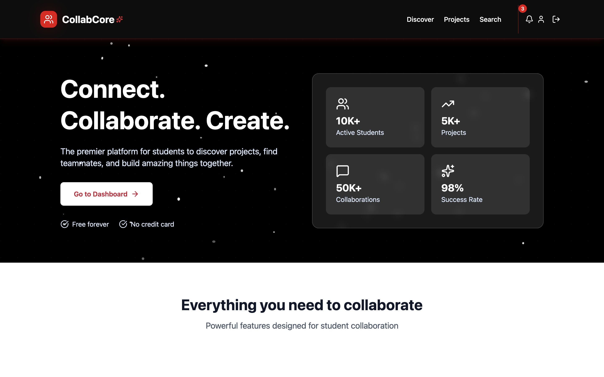
</p>

<p align="center">
  <strong>A modern, full-stack platform for students to collaborate on projects, find team members, and build amazing things together.</strong>
</p>

<p align="center">
  <a href="https://reactjs.org/"></a>
  <a href="https://fastapi.tiangolo.com/"></a>
  <a href="https://firebase.google.com/"></a>
  <a href="https://tailwindcss.com/"></a>
  <a href="https://opensource.org/licenses/MIT"></a>
</p>

<p align="center">
  <a href="#-quick-start">🚀 Quick Start</a> •
  <a href="#-screenshots">📸 Screenshots</a> •
  <a href="#️-tech-stack">🛠️ Tech Stack</a> •
  <a href="#-documentation">📖 Documentation</a>
</p>

---

## 🌟 Features

### 🔍 **Project Discovery & Matching**
- **AI-Powered Search**: Semantic skill matching to find perfect teammates
- **Advanced Filters**: Filter by skills, university, difficulty, duration
- **Smart Recommendations**: Get project suggestions based on your profile

### 👥 **Team Collaboration**
- **Real-time Chat**: Instant messaging with emoji support
- **Task Management**: Kanban boards with drag-and-drop functionality
- **Meeting Scheduler**: Built-in video calling with analytics
- **Document Sharing**: Collaborative document editing and version control

### 🚀 **Project Management**
- **Project Workspaces**: Dedicated spaces for each project
- **Application System**: Apply to join projects with custom messages
- **Progress Tracking**: Visual progress indicators and analytics
- **GitHub/GitLab Integration**: Connect repositories and track commits

### 🎨 **Modern UI/UX**
- **Beautiful Design**: Clean, modern interface with smooth animations
- **Responsive**: Works perfectly on desktop, tablet, and mobile
- **Dark Mode**: Toggle between light and dark themes
- **Accessibility**: Built with accessibility best practices

---

## 📸 Screenshots

### 🏠 **Home Page**
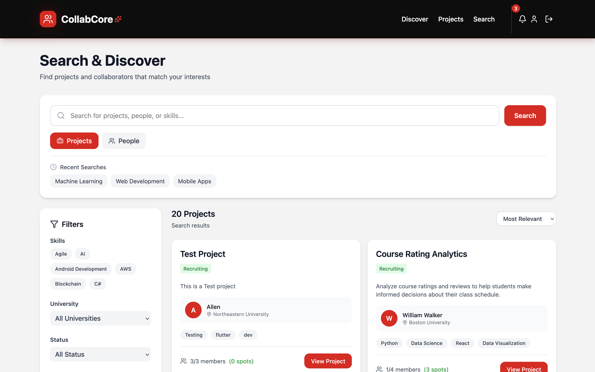

*Beautiful landing page with animated particles and clear call-to-action*

### 🔍 **Project Discovery**
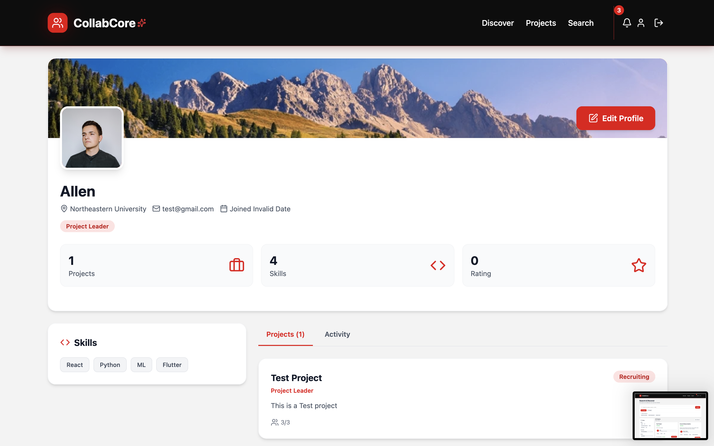

*Discover projects with advanced filtering and search capabilities*

### 📋 **My Projects Dashboard**
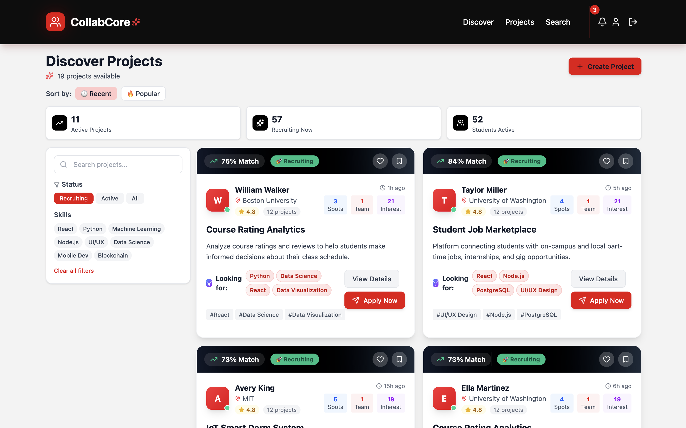

*Manage all your projects with progress tracking and quick actions*

### 💼 **Project Workspace**
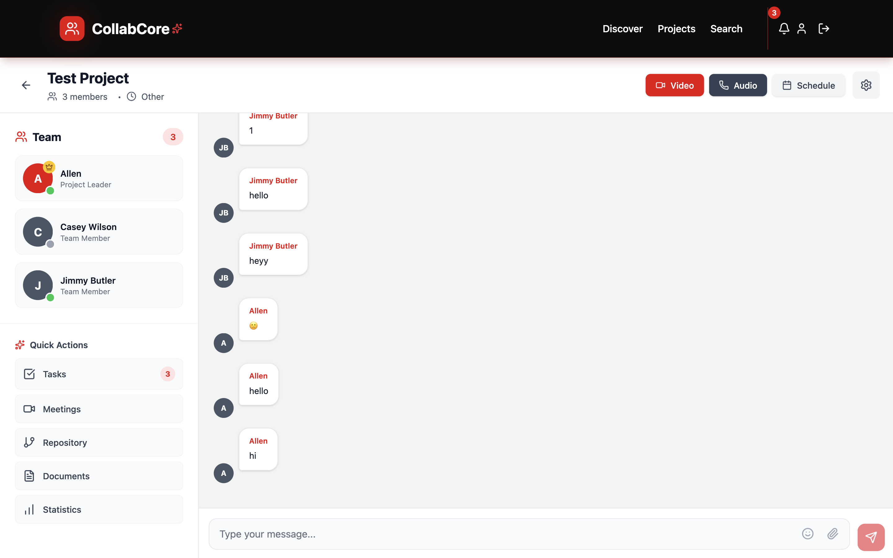

*Comprehensive workspace with chat, tasks, meetings, and file management*

### ✅ **Task Management**
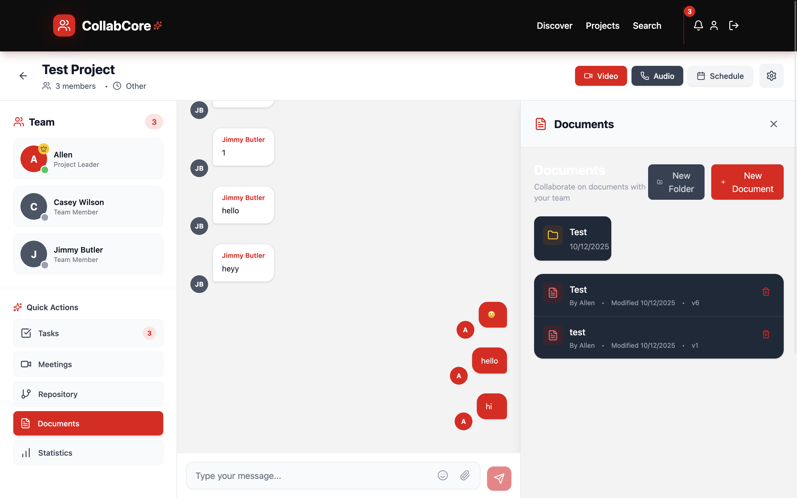

*Kanban-style task board with drag-and-drop functionality*

### 💬 **Real-time Chat**
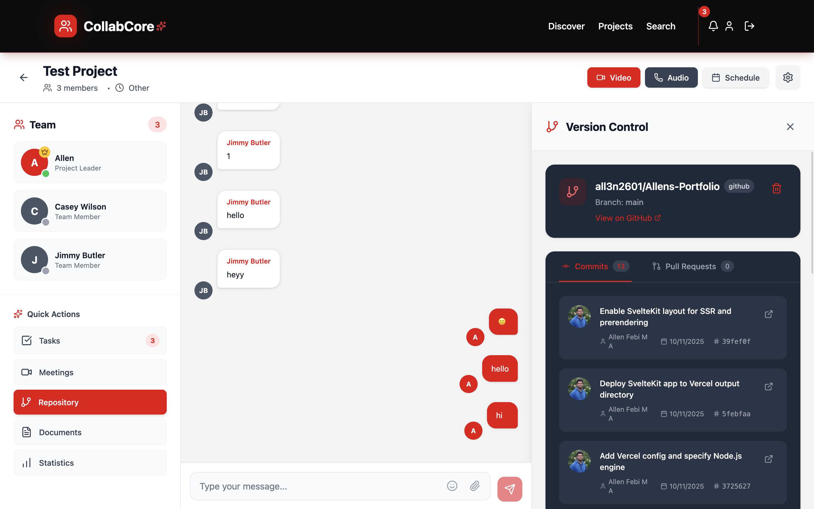

*Modern chat interface with emoji support and file sharing*

### 📊 **Meeting Analytics**
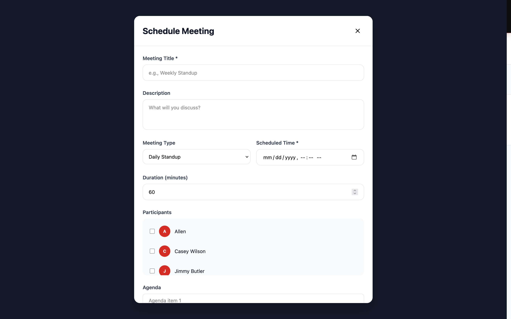

*Detailed analytics for team meetings and collaboration metrics*

### ⚙️ **Project Settings**
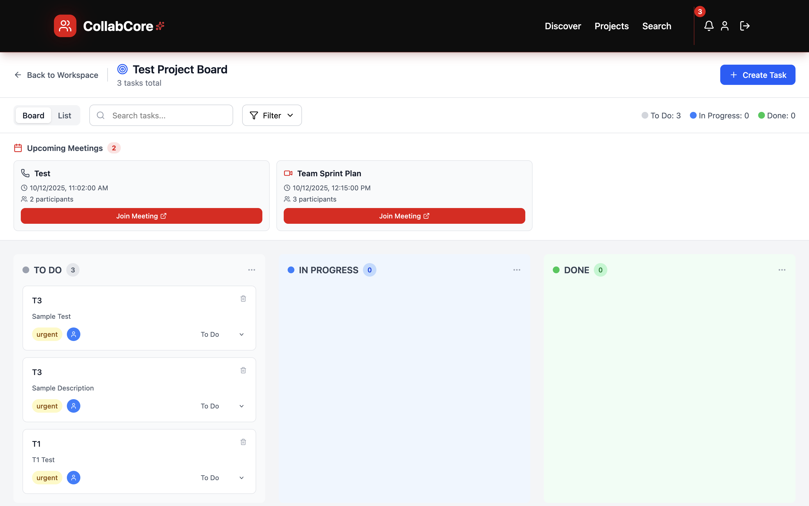

*Comprehensive project configuration and team management*

---

## 🚀 Quick Start

### Prerequisites
- **Node.js** (v16 or higher)
- **Python** (3.9 or higher)
- **Git**

### 🎯 **Option 1: Frontend Only (Recommended for Quick Demo)**
Perfect for exploring the UI and features without backend setup.

```bash
# Clone the repository
git clone https://github.com/yourusername/collabcore.git
cd collabcore

# Install and run frontend
cd collabcore-frontend
npm install
npm run dev
```

✅ **Uses mock data - no backend setup required!**
🌐 **Access at**: http://localhost:5173

### 🔧 **Option 2: Full Stack Development**
For complete functionality with real database and authentication.

```bash
# 1. Setup Backend
cd backend
pip install -r requirements.txt

# 2. Configure Firebase (see backend/README.md for detailed setup)
# - Create Firebase project
# - Download service account key
# - Set environment variables

# 3. Run backend
uvicorn main_enhanced:app --reload

# 4. Setup Frontend (new terminal)
cd ../collabcore-frontend
npm install
npm run dev
```

🌐 **Access Points**:
- **Frontend**: http://localhost:5173
- **Backend API**: http://localhost:8000
- **API Documentation**: http://localhost:8000/docs

---

## �️ Tech Stack

### 🎨 **Frontend**
| Technology | Version | Purpose |
|------------|---------|---------|
| **React** | 19.1.1 | UI Framework |
| **Vite** | 7.1.7 | Build Tool & Dev Server |
| **TailwindCSS** | 4.1.14 | Styling & Design System |
| **Framer Motion** | 12.23.24 | Animations & Transitions |
| **React Router** | 7.9.4 | Client-side Routing |
| **TanStack Query** | 5.90.2 | Data Fetching & Caching |
| **Lucide React** | 0.545.0 | Icon Library |
| **Firebase** | 12.4.0 | Authentication & Database |
| **Socket.io** | 4.8.1 | Real-time Communication |

### ⚙️ **Backend**
| Technology | Version | Purpose |
|------------|---------|---------|
| **FastAPI** | 0.115.0 | Web Framework |
| **Firebase Admin** | 6.5.0 | Authentication & Database |
| **Uvicorn** | 0.32.0 | ASGI Server |
| **Cloudinary** | 1.40.0+ | File Upload & Storage |
| **Python** | 3.9+ | Runtime Environment |

### 🗄️ **Database & Services**
- **Firestore**: NoSQL document database
- **Firebase Auth**: User authentication
- **Cloudinary**: Image and file storage
- **GitHub/GitLab API**: Repository integration

---

## 📁 Project Structure

```
collabcore/
├── 📱 Frontend (React + Vite)
│   └── collabcore-frontend/
│       ├── src/
│       │   ├── pages/              # Page components
│       │   ├── components/         # Reusable UI components
│       │   ├── contexts/           # React contexts (Auth, Theme)
│       │   ├── services/           # API services
│       │   ├── data/               # Mock data for development
│       │   └── styles/             # Global styles and themes
│       └── public/                 # Static assets
│
├── 🔧 Backend (FastAPI + Firebase)
│   └── backend/
│       ├── main_enhanced.py        # Main API application
│       ├── models.py               # Data models
│       ├── firebase_config.py      # Firebase configuration
│       ├── *_models.py             # Feature-specific models
│       ├── *_service.py            # External service integrations
│       └── requirements.txt        # Python dependencies
│
├── 📸 imgs/                        # Screenshots for README
├── 📚 Documentation/               # Comprehensive guides
└── 🔧 Configuration files          # Various config files
```

---

## 🚀 Key Features Deep Dive

### 🔍 **Smart Project Discovery**
- **Semantic Search**: Find projects using natural language
- **Skill Matching**: AI-powered teammate recommendations
- **University Filters**: Connect with students from your institution
- **Category Browsing**: Explore projects by domain (AI, Web Dev, Mobile, etc.)

### 👥 **Collaborative Workspaces**
- **Real-time Chat**: Instant messaging with emoji reactions
- **Task Management**: Kanban boards with drag-and-drop
- **File Sharing**: Upload and organize project documents
- **Meeting Scheduler**: Built-in video calling with screen sharing

### 📊 **Project Analytics**
- **Progress Tracking**: Visual progress indicators
- **Team Performance**: Meeting analytics and participation metrics
- **Milestone Management**: Track project phases and deadlines
- **Contribution Insights**: See who's contributing what

### 🔐 **Security & Privacy**
- **Firebase Authentication**: Secure user management
- **Role-based Access**: Project owners, members, and viewers
- **Data Encryption**: All communications are encrypted
- **Privacy Controls**: Control who can see your profile and projects

---

## 📖 Documentation

| Document | Description | Audience |
|----------|-------------|----------|
| **QUICK_START.md** | 5-minute setup guide | Everyone |
| **PROJECT_INDEX.md** | Complete project overview | Developers |
| **BACKEND_API_SPEC.md** | REST API documentation | Backend Developers |
| **FRONTEND_BACKEND_INTEGRATION.md** | Integration guide | Full-stack Developers |
| **DATA_STRUCTURE_SUMMARY.md** | Database schema | Database Developers |
| **collabcore-frontend/src/data/README.md** | Mock data usage | Frontend Developers |

---

## 🎯 Development Workflow

### 🔄 **Phase 1: Frontend Development (Current)**
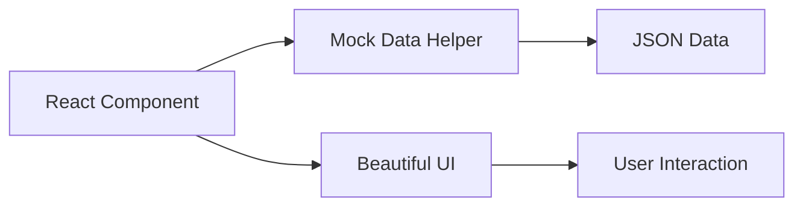

### 🔄 **Phase 2: Backend Integration**
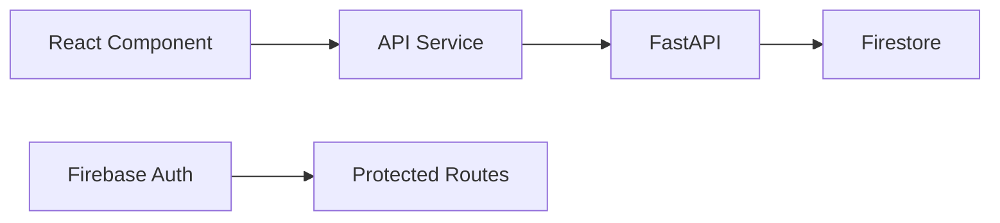

### 🔄 **Phase 3: Production Deployment**
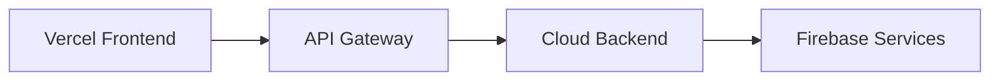

---

## � Development Commands

### 🎨 **Frontend Commands**
```bash
# Development
npm run dev          # Start development server
npm run build        # Build for production
npm run preview      # Preview production build
npm run lint         # Run ESLint

# Package Management
npm install          # Install dependencies
npm update           # Update dependencies
```

### ⚙️ **Backend Commands**
```bash
# Development
uvicorn main_enhanced:app --reload    # Start with auto-reload
uvicorn main_enhanced:app --host 0.0.0.0 --port 8000  # Production mode

# Database
python seed_data.py                   # Populate with sample data
python test_api.py                    # Test all endpoints

# Dependencies
pip install -r requirements.txt       # Install dependencies
pip freeze > requirements.txt         # Update requirements
```

---

## 🌟 Feature Checklist

### ✅ **Completed Features**
- 🔐 **Authentication**: Login, Register, Protected Routes
- 🏠 **Home Page**: Beautiful landing with animations
- 🔍 **Discovery**: Project browsing with filters
- 📋 **My Projects**: Dashboard with progress tracking
- 👤 **Profile Management**: User profiles and editing
- 💼 **Project Workspaces**: Comprehensive project management
- 💬 **Real-time Chat**: Messaging with emoji support
- ✅ **Task Management**: Kanban boards with drag-and-drop
- 📊 **Analytics**: Meeting and project analytics
- ⚙️ **Settings**: Project configuration and team management
- 🎨 **Modern UI**: Responsive design with dark mode
- 📱 **Mobile Ready**: Works on all device sizes

### 🚧 **In Development**
- 📹 **Video Calling**: WebRTC integration
- 🔔 **Notifications**: Real-time notifications
- 📁 **File Management**: Advanced document collaboration
- 🤖 **AI Features**: Enhanced skill matching
- 📈 **Advanced Analytics**: Detailed project insights

### 🎯 **Planned Features**
- 🔗 **GitHub Integration**: Repository linking
- 📅 **Calendar Integration**: Meeting scheduling
- 🏆 **Achievements**: Gamification elements
- 🌐 **Internationalization**: Multi-language support

---

## 🚀 Deployment

### 🌐 **Frontend Deployment (Vercel - Recommended)**

1. **Build the project**:
   ```bash
cd collabcore-frontend
   npm run build
```

2. **Deploy to Vercel**:
   ```bash
# Install Vercel CLI
   npm i -g vercel

   # Deploy
   vercel --prod
```

3. **Environment Variables**:
   - `VITE_FIREBASE_API_KEY`
   - `VITE_FIREBASE_AUTH_DOMAIN`
   - `VITE_FIREBASE_PROJECT_ID`
   - `VITE_API_BASE_URL`

### ⚙️ **Backend Deployment (Railway/Render)**

1. **Railway Deployment**:
   ```bash
cd backend
   railway login
   railway init
   railway up
```

2. **Render Deployment**:
   - Connect your GitHub repository
   - Set build command: `pip install -r requirements.txt`
   - Set start command: `uvicorn main_enhanced:app --host 0.0.0.0 --port $PORT`

3. **Environment Variables**:
   - `FIREBASE_SERVICE_ACCOUNT_KEY`
   - `CLOUDINARY_CLOUD_NAME`
   - `CLOUDINARY_API_KEY`
   - `CLOUDINARY_API_SECRET`

---

## 🤝 Contributing

We welcome contributions! Here's how to get started:

### 🔧 **Development Setup**
1. Fork the repository
2. Clone your fork: `git clone https://github.com/yourusername/collabcore.git`
3. Create a feature branch: `git checkout -b feature/amazing-feature`
4. Follow the setup instructions above

### 📝 **Contribution Guidelines**
- Follow the existing code style
- Write clear commit messages
- Add tests for new features
- Update documentation as needed
- Submit a pull request with a clear description

### 🐛 **Bug Reports**
- Use the GitHub issue tracker
- Include steps to reproduce
- Provide screenshots if applicable
- Mention your environment (OS, browser, etc.)

---

## � License

This project is licensed under the MIT License - see the [LICENSE](LICENSE) file for details.

```
MIT License

Copyright (c) 2024 CollabCore

Permission is hereby granted, free of charge, to any person obtaining a copy
of this software and associated documentation files (the "Software"), to deal
in the Software without restriction, including without limitation the rights
to use, copy, modify, merge, publish, distribute, sublicense, and/or sell
copies of the Software, and to permit persons to whom the Software is
furnished to do so, subject to the following conditions:

The above copyright notice and this permission notice shall be included in all
copies or substantial portions of the Software.
```

---

## 🙏 Acknowledgments

- **React Team** for the amazing framework
- **Vercel** for the incredible deployment platform
- **Firebase** for backend services
- **Tailwind CSS** for the utility-first CSS framework
- **Framer Motion** for beautiful animations
- **Lucide** for the beautiful icon set

---

## 📞 Support & Community

- 📧 **Email**: support@collabcore.dev
- 💬 **Discord**: [Join our community](https://discord.gg/collabcore)
- 🐛 **Issues**: [GitHub Issues](https://github.com/yourusername/collabcore/issues)
- 📖 **Documentation**: Check the `/docs` folder
- 🎥 **Video Tutorials**: Coming soon!

---

<p align="center">
  <strong>🎉 Ready to Build Something Amazing?</strong>
</p>

<p align="center">
  <strong>CollabCore makes student collaboration effortless and fun!</strong>
</p>

<p align="center">
  <a href="QUICK_START.md">� Get Started</a> •
  <a href="PROJECT_INDEX.md">📖 Documentation</a> •
  <a href="https://github.com/yourusername/collabcore">🌟 Star on GitHub</a>
</p>

---

<p align="center">
  <strong>Made with ❤️ by students, for students</strong>
</p>

<p align="center">
  <em>Happy Collaborating!</em> 🚀
</p>